# 🕷️ Web Scraping Pipeline Project

## 🛠️ Project Setup

### 🐍 Create Python Runtime Environment

```bash
python -m venv .venv
```

### ⚡ Activate Python Runtime Environment

```bash
source .venv/bin/activate
```

### 📦 Install Python Packages

```bash
# Upgrade pip
python -m pip install --upgrade pip

# Install required libraries
pip install -r requirements.txt
```

### 🎭 Install Playwright in CLI Environment

```bash
playwright install firefox
```

---

## 🚀 Project Run Instructions

This project follows a modular scraping pipeline managed via a single entry point script: `run_script.py`.

Each run is configured via the `configs.yml` file with the following fields:

| Field       | Description                                                       |
| ----------- | ----------------------------------------------------------------- |
| `run_group` | Logical group name for related scraping jobs                     |
| `run_name`  | Specific scraping job within the group                           |
| `run_type`  | Determines which script to execute (`extract`, `transform`, or `load`) |

---

### 🧭 Script Responsibilities

| `run_type`  | Script                           | Description                                                                                         |
| ----------- | -------------------------------- | --------------------------------------------------------------------------------------------------- |
| `extract`   | `extract/scraper_extractor.py`   | Scrapes data from the marketplace website and stores it in a JSON file                             |
| `transform` | `transform/scraper_transform.py` | Loads the JSON output from the `extract` run, scrapes detailed data, and saves it to a new JSON file |
| `load`      | `load/scraper_load.py`          | Cleans the data collected by `transform` and exports it as a timestamped CSV file                  |

---

### 🔁 Pipeline Workflow & Dependencies

Scripts must be executed in the following order due to data dependencies:

```text
Step 1: scraper_extractor.py   → Collects initial high-level data
Step 2: scraper_transform.py   → Uses output from Step 1 to add detailed data
Step 3: scraper_load.py        → Uses output from Step 2 to clean and save results
```

---

### ▶️ How to Run the Script

To run the pipeline from the command line, use a [Taskfile](https://taskfile.dev/).

- `MAX` maps to the `--max` argument inside `Taskfile.yml`
- ⚠️ **Note**: `MAX` is required when `RUN_MODE` is set to `"extract"`; otherwise, it can remain empty
- Python CLI arguments are defined and managed via the Taskfile
- The Taskfile command for running the Python script via the CLI is shown below:

```bash
# You can also run the Python script directly, if preferred.
# Make sure to check `configs.yml` and provide valid values for:
# --run_group, --run_name, --run_mode, and --max (if applicable).
# Example:
# python run_script.py --run_group "electronics" --run_name "camera-photo" --run_mode "extract" --max 1

# Recommended Taskfile-based execution:
task cli-runner:run RUN_GROUP="electronics" RUN_NAME="camera-photo" RUN_MODE="extract" MAX=1
```

#### 🧭 Run Pipeline Overview (CLI)

```mermaid
flowchart TD
    %% Define styles for modern look
    classDef startEnd fill:#e1f5fe,stroke:#01579b,stroke-width:2px,color:#000
    classDef process fill:#f3e5f5,stroke:#4a148c,stroke-width:2px,color:#000
    classDef decision fill:#fff3e0,stroke:#e65100,stroke-width:2px,color:#000
    classDef success fill:#e8f5e8,stroke:#2e7d32,stroke-width:2px,color:#000
    classDef error fill:#ffebee,stroke:#c62828,stroke-width:2px,color:#000
    
    %% Main flow
    A[🚀 Start] --> B[👤 User runs CLI command via Taskfile]
    B --> C[📋 Taskfile loads commands and variables from both RunCLI.yml and CommonVars.yml]
    C --> D{🔍 RUN_MODE == extract}
    D -->|✅ Yes| E[🔢 Check if MAX is provided]
    D -->|❌ No| F[▶️ Run without MAX]
    E -->|🎯 MAX provided| G[⚡ Execute run_script.py with all args]
    E -->|⚠️ MAX missing| H[❌ Fail with error: MAX is required]
    F --> G
    G --> I[💾 Cleaned data is saved to /data folder]
    I --> J[🎉 End]
    
    %% Apply styles
    class A,J startEnd
    class B,C,F,G,I process
    class D,E decision
    class H error
```

