# 🕷️ Web Scraping Pipeline Project

## 🛠️ Project Setup

### 🐍 Create Python Virtual Environment

```bash
python -m venv .venv
```

### ⚡ Activate the Virtual Environment

```bash
source .venv/bin/activate
```

### 📦 Install Required Python Packages

```bash
# Upgrade pip
python -m pip install --upgrade pip

# Install packages from requirements.txt
pip install -r requirements.txt
```

### 🎭 Install Playwright in CLI Environment

```bash
playwright install firefox
```

---

## 🚀 Project Execution Guide

This project uses a modular web scraping pipeline, managed via a single entry-point script: `run_script.py`.

Each pipeline run is configured through the `configs.yml` file, using the fields below:

| Field       | Description                                                           |
| ----------- | --------------------------------------------------------------------- |
| `run_group` | A logical group name for related scraping jobs                        |
| `run_name`  | The specific scraping task within the group                           |
| `run_type`  | The stage of the pipeline to execute (`extract`, `transform`, `load`) |

---

### 🧭 Script Responsibilities

| `run_type`  | Script                           | Responsibility                                                                         |
| ----------- | -------------------------------- | -------------------------------------------------------------------------------------- |
| `extract`   | `extract/scraper_extractor.py`   | Scrapes summary data from the target website and saves it to a JSON file               |
| `transform` | `transform/scraper_transform.py` | Loads the JSON from `extract`, scrapes detailed product data, and outputs another JSON |
| `load`      | `load/scraper_load.py`           | Cleans the transformed data and saves the final output to a timestamped CSV            |

---

### 🔁 Pipeline Workflow and Script Order

Scripts **must be executed in sequence** due to data dependencies:

```text
Step 1: scraper_extractor.py   → Collect high-level metadata
Step 2: scraper_transform.py   → Use Step 1 output to gather detailed records
Step 3: scraper_load.py        → Clean Step 2 output and export as CSV
```

---

### ▶️ Running the Pipeline

To run the pipeline via CLI, it is recommended to use a [Taskfile](https://taskfile.dev/).

* `MAX` maps to the `--max` CLI argument in `Taskfile.yml`
* ⚠️ **Note**: `MAX` is required only when `RUN_MODE` is set to `"extract"`
* Python CLI arguments are centrally defined via the Taskfile for ease of use

```bash
# Run the pipeline directly (for debugging or quick tests):
python run_script.py \
  --run_group "electronics" \
  --run_name "camera-photo" \
  --run_mode "extract" \
  --max 1

# Preferred Taskfile-based command:
task cli-runner:run \
  RUN_GROUP="electronics" \
  RUN_NAME="camera-photo" \
  RUN_MODE="extract" \
  MAX=1
```

---

#### 🧭 Run Pipeline Overview (CLI)

```mermaid
flowchart TD
    %% Define styles for modern look
    classDef startEnd fill:#e1f5fe,stroke:#01579b,stroke-width:2px,color:#000
    classDef process fill:#f3e5f5,stroke:#4a148c,stroke-width:2px,color:#000
    classDef decision fill:#fff3e0,stroke:#e65100,stroke-width:2px,color:#000
    classDef success fill:#e8f5e8,stroke:#2e7d32,stroke-width:2px,color:#000
    classDef error fill:#ffebee,stroke:#c62828,stroke-width:2px,color:#000
    
    %% Main flow
    A[🚀 Start] --> B[👤 User runs CLI command via Taskfile]
    B --> C[📋 Taskfile loads commands and variables from both RunCLI.yml and CommonVars.yml]
    C --> D{🔍 RUN_MODE == extract}
    D -->|✅ Yes| E[🔢 Check if MAX is provided]
    D -->|❌ No| F[▶️ Run without MAX]
    E -->|🎯 MAX provided| G[⚡ Execute run_script.py with all args]
    E -->|⚠️ MAX missing| H[❌ Fail with error: MAX is required]
    F --> G
    G --> I[💾 Cleaned data is saved to /data folder]
    I --> J[🎉 End]
    
    %% Apply styles
    class A,J startEnd
    class B,C,F,G,I process
    class D,E decision
    class H error
```



---

## ✅ Deployment Steps (Recap)

```bash
# Step 1: Install MkDocs and Material theme
pip install mkdocs-material

# Step 2: Serve locally
mkdocs serve -a localhost:8001

# Step 3: Deploy to GitHub Pages
mkdocs gh-deploy
```